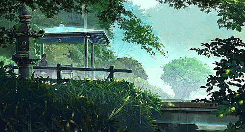

  

<h1 align="center">Hi, I'm Tanmay Patil 👋</h1>

  Software Engineering student with a strong academic foundation and a focused interest in
  core computer science subjects, problem-solving, and software development.

---

## 🎓 Academic Focus
- 🎓 Software Engineering Student
- 📘 Data Structures & Algorithms (DSA)
- 🗄️ Database Management Systems (DBMS)
- 🧠 Object-Oriented Programming (OOP)

---

## 💻 Technical Interests
- 🎮 Game Development (logic, systems, mechanics)
- 🧩 Problem Solving & DSA
- 🗃️ Database Design & SQL
- 🖥️ Core Software Engineering Concepts

---

## 🛠️ Technical Skills
- **Programming Languages:** C / C++ / Java
- **Core Subjects:** DSA, DBMS, OOP
- **Tools:** Git, GitHub, VS Code
- **Databases:** MySQL / SQL

---

## 📌 Academic Goals
- Build strong problem-solving ability
- Strengthen understanding of core CS subjects
- Apply theoretical knowledge to practical projects
- Prepare for software engineering roles

---

## 🎯 Hobbies & Interests
- 🏸 Playing Badminton
- 📺 Watching TV Shows
- 🎮 Exploring Game Design Concepts

---

## 🔗 Connect With Me

  
  
  

---

  <i>Focused on consistency, learning, and academic excellence.</i>

